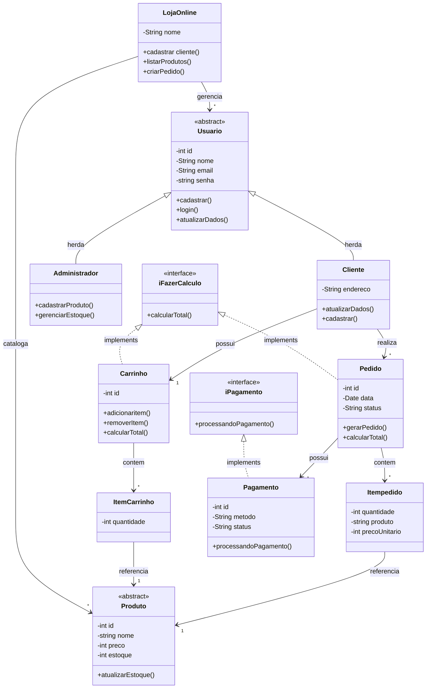

# Sistema de vendas online 

## Explicando como os conceitos de POO serão aplicados no nosso sistema:

## Encapsulamento: 
### Vamos usar o encapsulamento, já que todos os atributos das classes são privados, ou seja, ós vamos precisar de getters e setters para acessá-los.

## Herança:
### Usaremos herança em usuário, e cliente e administrador herdaram os atributos dessa entidade abstrata.

## Polimorfismo:
### Nos comportamentos de usuário, pois são diferentes(em atualizarDados()por exemplo, ambos atualizam, mas de frma diferente), apesar de herdarem de usuário.

## Abstração:
### Temos abstração em usuário e produto, porque não faz sentido criar um usuário genérico ou um produto genérico. Sempre temos tipos de usuários e tipos de produtos.

## Interfaces:
### Criamos as interfaces para FazerCalculo(Para ser implementada em pedido e carrinho, já que em ambos temos o calcularTotal()) e Pagamento(Porque há mais de um tipo de pagamento, como pix, boleto e cartão).

## Tratamento de excessões
### Usaremos o tratamento de excessões caso o cliente tente comprar algo com estoque 0, tente logar com email e/ou senha errados, tente colocar uma quntidade inválida no carrinho (como um número negativo ou um número maior do que o disponível no estoque).

## Código do diagrama feito no mermaid:

